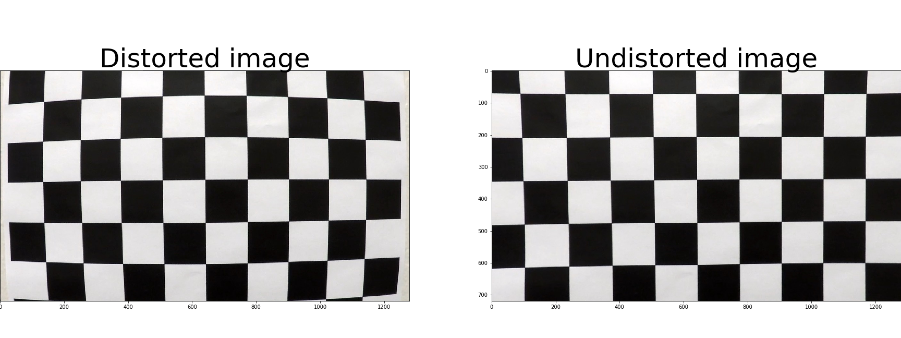
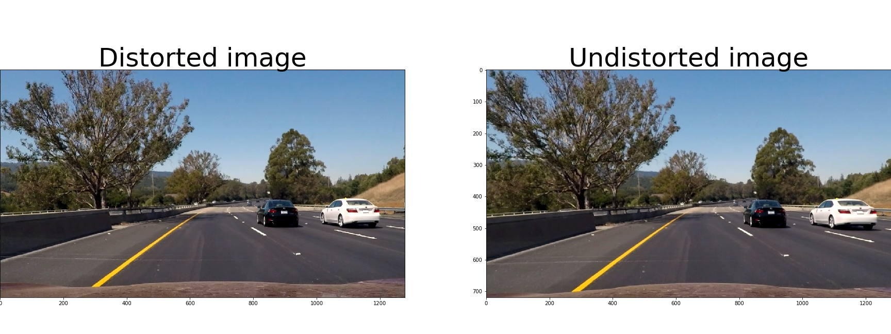
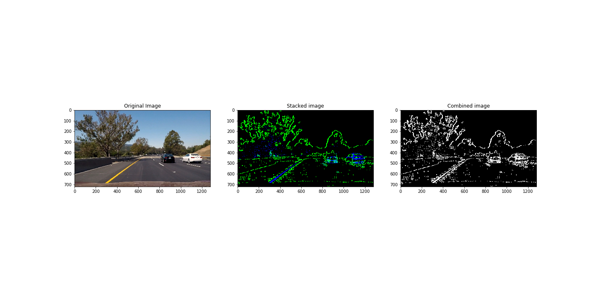
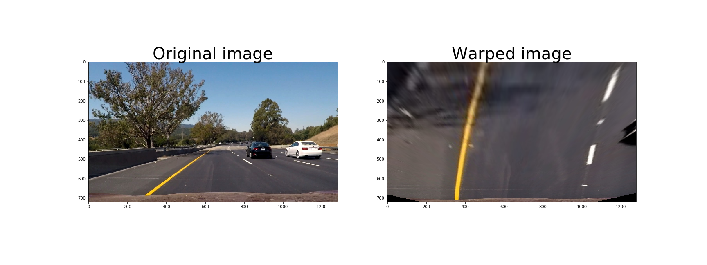
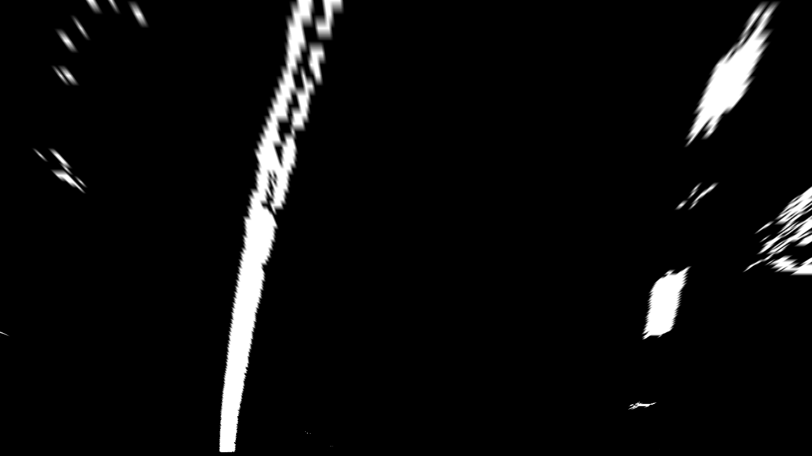
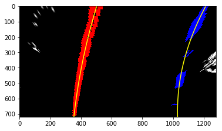
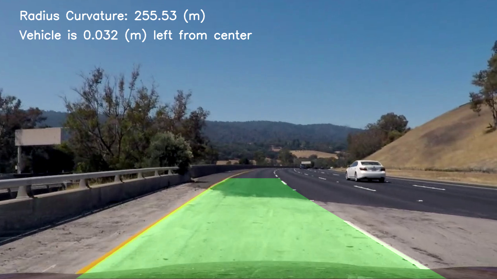

## Writeup report

You can see a jupyter notebook where you can run the pipleine in the file `advanced_lane_line_detection.ipynb`. There is also a step by step approach in the notebook `lane_lines_detection.ipynb` but is considered a first version of this project. 

### Camera Calibration
#### 1. Computing the camera matrix and distortion coefficients to undistort images

The code for this step is contained in the python file module `calibration_module.py`.  

In function `calculate_calibration_objects` start by preparing "object points", which will be the (x, y, z) coordinates of the chessboard corners in the world. Here I am assuming the chessboard is fixed on the (x, y) plane at z=0, such that the object points are the same for each calibration image.  Thus, `objp` is just a replicated array of coordinates, and `objpoints` will be appended with a copy of it every time I successfully detect all chessboard corners in a test image.  `imgpoints` will be appended with the (x, y) pixel position of each of the corners in the image plane with each successful chessboard detection.  

I then created the function `calibrate_camera` that calls `calculate_calibration_objects` function in order to get the `objpoints` and `imgpoints` to compute the camera calibration and distortion coefficients using the `cv2.calibrateCamera()` function.  

I then defined the `undistort` function that receives an image, the camera matrix and the distortion coefficients and returns the undistorted image using the `cv2.undistort()` function. The result of applying the `undistort` function to an image is like this: 



### Pipeline (single images)

The notebook `advanced_lane_line_detection` is the starting point when we can run the code and see the pipeline implemented for a single image

#### 1. Example of a distortion-corrected image.

To demonstrate this step, I will describe how I apply the distortion correction to one of the test images like this one:


#### 2. Color and gradient thresholding

In module `thresholding_module.py` I defined the `combined_threshold` function that use a combination of color and gradient thresholds to generate a binary image. The gradient threshold itself is a combination of gradients, in this case `sobel_x` (function `abs_sobel` with thresholding steps in lines #31 - #39), `sobel_y` (function `abs_sobel`), `sobel_magnitude` (function `mag_gradient`, lines #48 - #53) and `gradient_direction` (function `dir_gradient`, lines #62 - #68). The color threshold is a combination of HLS and HSV color spaces. In particular I used the S channel and the V channel (lines #12 - #22). Here's an example of my output for this step for one of the configurations tried:


The left image is the original, the right image is the binary image with color and gradient threshold and the image in the middle correponds to pixels that were thresholded by color and by gradient

#### 3. Perspective transformation
The module `perspective_module.py` defines a function `warper()`, which appears in lines 4 through 23.  The `warper()` function takes as input an image (`img`), and define the source (`src`) and destination (`dst`) points to make the transformation.  I chose the hardcode the source and destination points in the following manner:

```python
src = np.float32(
    [[(img_size[0] / 2) - 55, img_size[1] / 2 + 100],
    [((img_size[0] / 6) - 10), img_size[1]],
    [(img_size[0] * 5 / 6) + 60, img_size[1]],
    [(img_size[0] / 2 + 55), img_size[1] / 2 + 100]])
dst = np.float32(
    [[(img_size[0] / 4), 0],
    [(img_size[0] / 4), img_size[1]],
    [(img_size[0] * 3 / 4), img_size[1]],
    [(img_size[0] * 3 / 4), 0]])
```

This resulted in the following source and destination points:

| Source        | Destination   | 
|:-------------:|:-------------:| 
| 585, 460      | 320, 0        | 
| 203, 720      | 320, 720      |
| 1127, 720     | 960, 720      |
| 695, 460      | 960, 0        |

I verified that my perspective transform was working as expected by drawing the `src` and `dst` points onto a test image and its warped counterpart to verify that the lines appear parallel in the warped image.




So far, if we follow the pipeline (undistort -> binary threshold -> change perpective) we get a binary warped image as follows:


#### 4. Identifying lane lines

In module `finding_lines_module.py` I defined the `sliding_window_search` function that follows the sliding window approach with the helper functions `find_lane_pixels` and `fit_poly`. The function `find_lane_pixels` follows the histogram approach to find pixels for each lane line, this is done from lines #9 through #13. Then from lines #29 - #50 the sliding window approach is followed and in lines #55 - #58 the pixels are obtained for each of the two lane lines. Then a 2 order polynomial is fitted on this points in line #125 with the helper function `fit_poly`. There is also a function `search_around_poly` that does not follow the sliding window approach from scratch, but instead search around region defined by the previous frame but is not actually enabled in the pipeline. The resulting image for this step is:




#### 5. Radius of curvature and vehicle position

In module `curvature_module.py` I defined the function `measure_curvature_real` that gets the real curvature in meters from lines #12 - #14 by having the real world poly coefficients (not pixels) and doing the calculation at y point that corresponds to the bottom of the image. There is also a function `calculate_car_position` that calculates the car position inside the lane region assuming the camera is on center of the car. This is donde in lines #24 - #27

There is also a function `warper_inv` in python module `perspective_module.py` that reverts the perspective applied to the binary image, in order to map the region lane on the original image. It requires the inverse matrix `Minv` calculated during the initial perspective change, the warped image and the points tha define the lane lines. This task is donde from lines #38 - #46 and the final image is as  follows:



### Pipeline (video)

The notebook `advanced_lane_line_detection` is the starting point when we can run the code and see the pipeline implemented for video. The resulting video is also attached with name `my_output_video.mp4` in this project

## Discussion
I found several issues with the my project. First I feel the perspective parameters `src` nad `dst` are not robust enough for every scenario. Second the sliding window parameters could fail to detect the lane lines and in some cases the diverge from the real pixels. There is also a shortcoming with sliding window so far because for every frame I use this approach.
There is also issues with fitting the lane lines, sometimes they are not parallel to each other and that causes that the curvature is also different each of the two lines

Outlier detection techniques could be useful as well as more sofisticated method that sliding window for subsequents frames as we saw in the course `search around poly approach`

I also think the way to determine the mapping from pixels to meters could be improved, I don't feel it is a robust meassure but I could be wrong